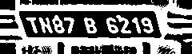
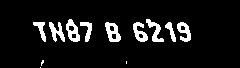
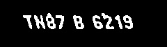
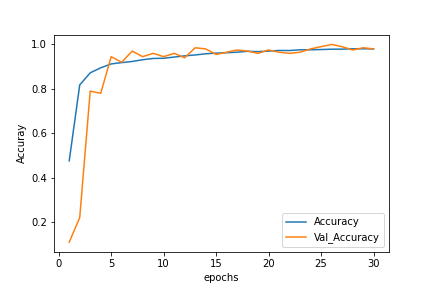
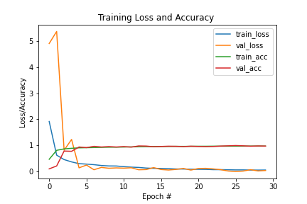

# License-plate-detection-and-recognition
Autonomous number plate recognition is a special form of optical character recognition (OCR).
It enable computer system to read automatically the license number of vehicles from digital pictures.
Reading automatically mean transforming the pixel of the digital  image into ASCII text of number plate.
Capturing of fast moving vehicles need special technique to avoid motion blur.

## Approach
The problem is divided into three sub problems. These are-
1. Number plate extraction 
2. Character segmentation 
3. Character recognition

## Number plate extraction
* YOLO algorithm was used for the object detection to detect our target object – ‘license’. The **imageai** implementation of the yolov3 convolutional neural network was used for this.Imageai is a powerful python library which provides computer vision capabilities using deep learning. Before training anchor boxes were created
With an iou (intersection over union) of 0.74. Transfer learning was used as it gave better result rather than training from scratch.

  

  

## Character segmentation
This character segmentation procedure consists of three sub parts.
* Adjusting the input image and generating a binary image is the first part.
* Analysing blobs which is a connected set of pixels in the binary image, and removing the noisy blobs and also merging and splitting the blobs is the second part. In this step it starts with CCA, the noncharacter blobs, plate boundaries, small dirties, and unrelated marks or bars are excluded.
* Correcting the rotated plate images and selecting final ten-character blobs is the last part.

  

  

  

## Character recognition
#### Training model
* The model is trained using deep learning and convolutional neural network. The model has a test accuracy of 98.5 percent and a validation accuracy of 98.00 percent.
* The model can recognise character rotated to max angle of 30 degree.
#### Character transformation and prediction
* The segmented image is resized into a 30 x 30 image. This operation is performed to ensure consistency with the input format of the learning model, where each font character that is fed during the training process is a resized 30 x 30 image. 
* After the resized image is fed to the model, the character is predicted.

  

  

  

 

 

